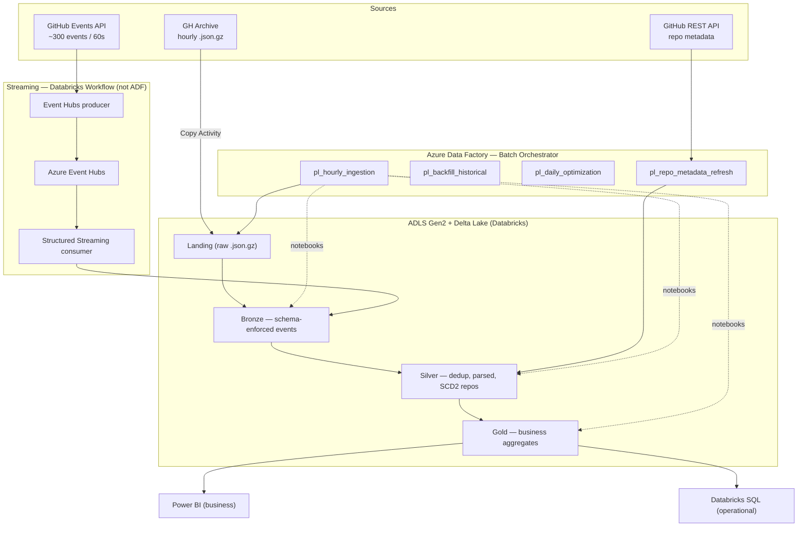

# GitHub Ecosystem Analytics Platform

[](https://github.com/manishsarmaa/gh-analytics-platform/actions/workflows/pr-checks.yml)

A production-grade data engineering platform on **Azure** that ingests GitHub
public event data ([GH Archive](https://data.gharchive.org/) + GitHub REST API),
processes it through a **medallion lakehouse** (Delta Lake on Azure Databricks),
and serves business + operational analytics.

**Azure Data Factory** is the master orchestrator for all batch pipelines;
a continuous **Databricks Workflow** handles the streaming path. The whole thing
is defined as code — Terraform for Azure, Databricks Asset Bundles for notebooks
and jobs, ADF pipelines as Git-tracked JSON — and shipped via GitHub Actions.

> Status: **Batch platform complete** (Phases 0–8, 12) — ingestion, medallion,
> SCD2 enrichment, gold analytics, maintenance, and CI/CD, all validated on real
> data. See the [phased plan](docs/phased-plan.md).
>
> **Compute note:** batch runs on **Databricks serverless** (the Azure trial caps
> regional vCPUs), and ADF triggers the serverless jobs via the Jobs API using
> its managed identity — see [CLAUDE.md](CLAUDE.md) / `memory/`.

---

## Architecture



**Why ADF for batch + Databricks Workflows for streaming:** ADF gives
first-class scheduling, control flow, monitoring, and alerting for batch DAGs.
It is not designed for long-running stream processing, so the continuous
Event Hubs → Structured Streaming path runs as a native Databricks job.

---

## Tech Stack

| Concern | Choice |
|---|---|
| Cloud | Azure (trial, `centralindia`) |
| Storage | ADLS Gen2 (hierarchical namespace) |
| Compute | Azure Databricks (Premium) — **serverless** jobs for batch |
| Lakehouse | Delta Lake |
| Batch orchestration | Azure Data Factory (Git-integrated) |
| Streaming | Event Hubs + Structured Streaming (Databricks Workflow) |
| Transformation | Parameterized Databricks notebooks (PySpark) |
| Data quality | Great Expectations + custom checks → `ops.dq_results` |
| IaC | Terraform (Azure) + Databricks Asset Bundles |
| CI/CD | GitHub Actions |
| Secrets | Azure Key Vault + Databricks secret scopes |
| BI | Power BI + Databricks SQL dashboard |

---

## Repository Layout

```
├── adf/              # ADF pipelines/datasets/linked services as JSON (Git-integrated)
├── infra/
│   ├── terraform/    # Azure resources (RG, ADLS, Event Hubs, KV, ADF, Databricks, RBAC)
│   └── databricks/   # Databricks Asset Bundle (databricks.yml)
├── src/
│   ├── notebooks/        # Databricks notebooks (deployed via DAB)
│   ├── transformations/  # Pure PySpark functions (unit-tested)
│   ├── dq/               # Great Expectations suites + runner
│   ├── utils/            # config, logging, delta helpers
│   └── streaming/        # Event Hubs producer
├── configs/          # dev.yaml / prod.yaml (non-secret env config)
├── tests/            # unit / integration / fixtures
├── dashboards/       # Power BI + Databricks SQL
├── docs/             # architecture, data dictionary, ADF docs, runbook
└── .github/workflows # PR checks + deploy pipelines
```

---

## Local Setup

```powershell
# 1. Create + activate the virtual environment
python -m venv .venv
.\.venv\Scripts\Activate.ps1

# 2. Install dependencies
pip install -r requirements.txt -r requirements-dev.txt

# 3. Install pre-commit hooks
pre-commit install

# 4. Run the checks
ruff check .
pytest -m unit
```

> PySpark unit tests require a local JDK (Java 8/11/17). Install
> [Temurin](https://adoptium.net/) if `pytest -m spark` can't find Java.

---

## Environments

Config is driven by `configs/<env>.yaml` (no secrets — those live in Key Vault).
Notebooks receive `env` as a parameter from ADF and load the matching config via
`src/utils/config.py`. `dev` is the working environment for the 30-day trial;
`prod` mirrors it and is a future target.

---

## Cost Guardrails

- **Job clusters over interactive**, auto-terminate on idle.
- Incremental MERGE writes, not full overwrites.
- ADF runs are cheap; **cluster time is the cost driver** — keep clusters small
  and short-lived. A running cost breakdown lives in [`docs/`](docs/).

---

## License

MIT
