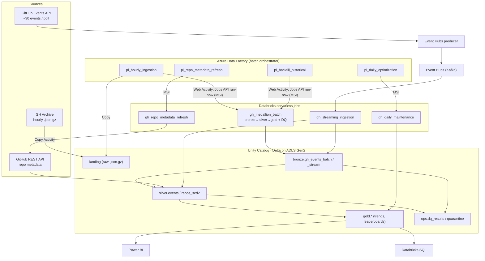

# Architecture

GitHub ecosystem analytics on Azure: batch + streaming ingestion of GitHub
events into a medallion lakehouse (Delta / Unity Catalog on Databricks),
orchestrated by Azure Data Factory, served to Databricks SQL + Power BI.

## As-built diagram

## Key design decisions

| Decision | Why |
|---|---|
| **Serverless compute for batch** | Azure trial caps regional vCPUs at 4 and classic clusters stocked out; serverless has no VM quota and starts in seconds. See `memory/compute-strategy-serverless.md`. |
| **ADF triggers Databricks *jobs* (Jobs API) via Web Activity + MSI** | ADF's native Notebook activity only drives classic clusters. Web Activity + `run-now` keeps ADF as orchestrator (schedule/monitor/alert/backfill) while Databricks owns compute — **no secrets** (managed identity). |
| **Pure functions + thin notebooks** | Transform logic is I/O-free in `src/transformations` (49 unit tests, runs on local Spark); notebooks only read/MERGE/write. Batch and streaming share it via `foreachBatch`. |
| **Idempotency everywhere** | bronze/silver MERGE on `event_id`; gold `replaceWhere` by `event_date`. Re-running any hour/day (or a parallel backfill) is safe. |
| **Schema enforced by construction** | Bronze reads text + `get_json_object` (no inference); `payload` kept raw. Bad rows → `ops.quarantine`. |
| **Two-tier DQ** | Custom Spark runner = full-table critical gate (fails the pipeline → ADF alerts); Great Expectations = declarative suites on a pandas sample (warning). Both → `ops.dq_results`. |
| **Streaming needs EH Standard** | Basic has no Kafka endpoint and serverless can't load the AMQP Spark JAR; the Kafka source works on serverless. |
| **SCD Type 2 for repos** | `silver.repos_scd2` tracks metadata history (validated: star/fork changes create new versions). |

## Data flow

1. **Batch**: ADF copies a GH Archive hour to `landing`, then `run-now`s the
   medallion job (params: env, execution_date, landing_path, source_file). The
   job runs bronze→silver→gold with per-layer DQ; ADF polls to completion.
2. **Enrichment**: `pl_repo_metadata_refresh` calls the GitHub API for the
   most-active repos (ranked by distinct actors to dodge spam) → SCD2 dimension.
3. **Maintenance**: `pl_daily_optimization` OPTIMIZE+ZORDER+VACUUM.
4. **Streaming**: a producer polls the GitHub Events API → Event Hubs; a
   serverless Structured Streaming job merges into `bronze.gh_events_stream` and
   `silver.events` (unified with batch via a `source` column).

See [data_dictionary.md](data_dictionary.md) and [runbook.md](runbook.md).
